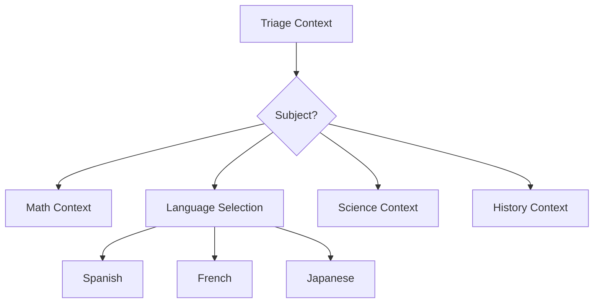

# SignalWire AI Tutor Bot Demo

A comprehensive demonstration of the SignalWire AI Agent SDK's context/steps feature, showcasing how context-level prompts enable unique teaching philosophies for different subjects.

## 🌟 Features Demonstrated

- **Context-Level Prompts**: Each subject has its own teaching personality and approach
- **Context Isolation**: Teaching philosophies remain separate and don't interfere
- **Multi-Language Support**: Language tutors can speak in their respective languages using ElevenLabs multilingual voices
- **Structured Workflows**: Clear progression through learning steps
- **Pedagogical Diversity**: Different teaching methods for different subjects

## 🎓 Available Tutors

### Professor Marcus - Math Tutor
- **Philosophy**: Mathematics is the language of logic and patterns
- **Approach**: Systematic problem-solving with visual understanding
- **Workflow**: Assessment → Guided Solution → Practice

### Language Tutors
- **Señora Lopez (Spanish)**: Immersion-based learning with cultural connection
- **Madame Dubois (French)**: Focus on elegance, precision, and pronunciation
- **Tanaka-sensei (Japanese)**: Cultural understanding and respect

### Dr. Stevens - Science Tutor
- **Philosophy**: Learning through inquiry and experimentation
- **Approach**: Socratic method, hypothesis formation
- **Workflow**: Inquiry → Hypothesis → Exploration

### Professor Thompson - History Tutor
- **Philosophy**: History as human experience and its lessons
- **Approach**: Narrative analysis and cause-effect relationships

## 🚀 Quick Start

### 1. Clone and Setup

```bash
# Clone the repository (or copy the files)
cd "Tutor Bot"

# Run the setup script
python setup.py
```

The setup script will:
- Create a virtual environment
- Install all dependencies
- Set up configuration files

### 2. Configure (Optional)

Copy `.env.example` to `.env` and customize if needed:

```bash
cp .env.example .env
```

### 3. Run the Demo

**Option A: Using the run script (Recommended)**

Windows:
```bash
run.bat
```

macOS/Linux:
```bash
chmod +x run.sh  # First time only
./run.sh
```

**Option B: Manual activation**

Windows:
```bash
venv\Scripts\activate
python tutor_bot_demo.py
```

macOS/Linux:
```bash
source venv/bin/activate
python tutor_bot_demo.py
```

The agent will start on `http://localhost:3000/tutor`

## 📋 System Requirements

- Python 3.8 or higher
- Internet connection (for SignalWire API)
- Approximately 500MB disk space for dependencies

## 🔧 Configuration Options

Edit `.env` to customize:

```env
# Server Configuration
TUTOR_BOT_HOST=0.0.0.0
TUTOR_BOT_PORT=3000
TUTOR_BOT_ROUTE=/tutor

# Proxy Configuration (if using ngrok)
PROXY_URL=https://your-proxy.ngrok.io

# Debug Mode
DEBUG=false

# Optional: Override Multilingual Voice
MULTILINGUAL_VOICE=elevenlabs.domi:multilingual
```

### 🎙️ Voice Configuration

The tutor bot uses **one consistent ElevenLabs multilingual voice** for all languages: `elevenlabs.domi:multilingual`

**Why one voice for all languages?**
- **Seamless Code-Switching**: Language tutors naturally mix languages (e.g., French teacher explaining grammar in English but speaking French examples)
- **Consistent Experience**: Same voice quality across all tutors
- **Proper Pronunciation**: The multilingual model handles authentic pronunciation for all languages
- **Pedagogically Correct**: Mirrors real-world language teaching where instructors code-switch

**Alternative Multilingual Voice Options:**
- `elevenlabs.charlotte:multilingual` - Sophisticated, clear
- `elevenlabs.sarah:multilingual` - Warm, friendly  
- `elevenlabs.liam:multilingual` - Professional, articulate
- `elevenlabs.Antoni:multilingual` - Expressive, engaging

You can customize the voice by editing the `.env` file and uncommenting `MULTILINGUAL_VOICE=your-preferred-voice`.

## 🎯 How It Works

### Context Flow



### Key Concepts

1. **Context Isolation**: Each context has `.set_isolated(True)` to maintain separate teaching personalities
2. **Context-Level Prompts**: Teaching philosophy is defined at the context level, not in individual steps
3. **Step Progression**: Each context has structured steps with completion criteria
4. **Navigation Control**: Steps define which contexts/steps can be accessed next

## 🛠️ Extending the Demo

### Adding Skills

To enhance the tutors with additional capabilities:

```python
# Add web search for smarter responses
self.add_skill("web_search", {
    "api_key": os.getenv("GOOGLE_SEARCH_API_KEY"),
    "search_engine_id": os.getenv("GOOGLE_SEARCH_ENGINE_ID")
})

# Add math calculations
self.add_skill("math")

# Add datetime for scheduling
self.add_skill("datetime")
```

### Creating New Subjects

To add a new subject tutor:

```python
# Create new context
programming = contexts.add_context("programming") \
    .set_isolated(True) \
    .add_section("Role", "You are Professor Ada, a programming mentor...") \
    .add_section("Teaching Philosophy", "Code is poetry that computers can understand...")

# Add steps
programming.add_step("language_choice") \
    .add_section("Current Task", "Determine which programming language to teach") \
    .set_step_criteria("Programming language selected") \
    .set_valid_steps(["concept_introduction"])
```

## 📚 Understanding the Code Structure

### Main Components

1. **TutorBotAgent Class**: The main agent with all contexts and steps
2. **Context Definitions**: Each subject is a separate context with unique prompts
3. **Step Workflows**: Learning progression within each subject
4. **Language Support**: Multi-language configuration with ElevenLabs voices

### Context vs Step Prompts

- **Context Prompts**: Define the overall teaching personality
- **Step Prompts**: Define specific tasks within the learning process

## 🐛 Troubleshooting

### Common Issues

1. **Port Already in Use**
   ```bash
   # Change port in .env
   TUTOR_BOT_PORT=3001
   ```

2. **Dependencies Not Installing**
   ```bash
   # Try upgrading pip first
   pip install --upgrade pip
   pip install -r requirements.txt
   ```

3. **Agent Not Starting**
   - Check Python version: `python --version` (needs 3.8+)
   - Ensure virtual environment is activated
   - Check for error messages in console

## 🤝 Contributing

This is a demo project showcasing SignalWire AI Agent SDK features. Feel free to:
- Add new subject tutors
- Enhance existing tutors with skills
- Improve teaching workflows
- Add more languages

## 📄 License

This demo is provided as-is for educational purposes.

## 🔗 Resources

- [SignalWire AI Agent SDK](https://github.com/signalwire/signalwire-agents)
- [SignalWire Documentation](https://docs.signalwire.com)
- [Context/Steps Guide](https://github.com/signalwire/signalwire-agents/docs/contexts_guide.md)
- [ElevenLabs Voice Library](https://elevenlabs.io/voices)

---

Built with ❤️ using SignalWire AI Agent SDK 